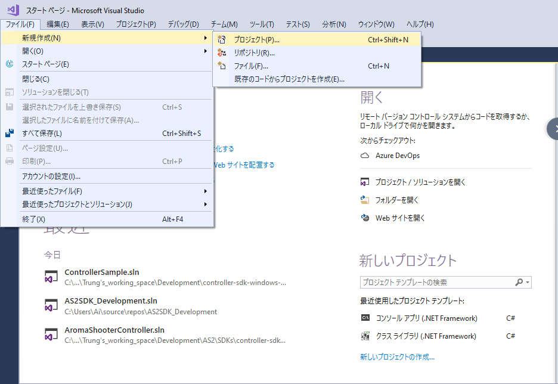
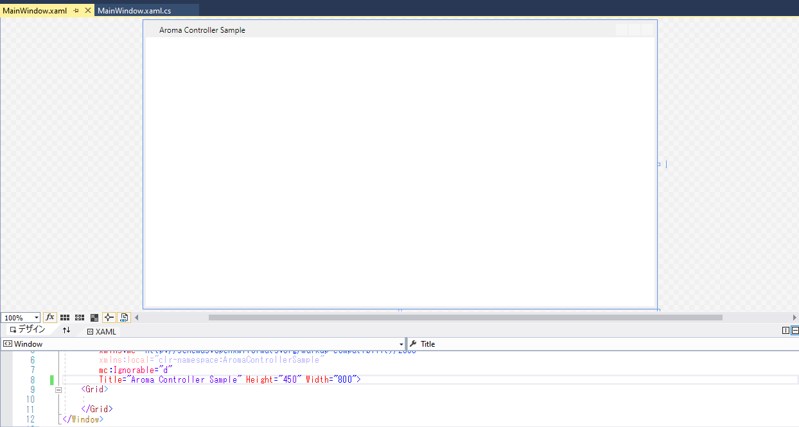
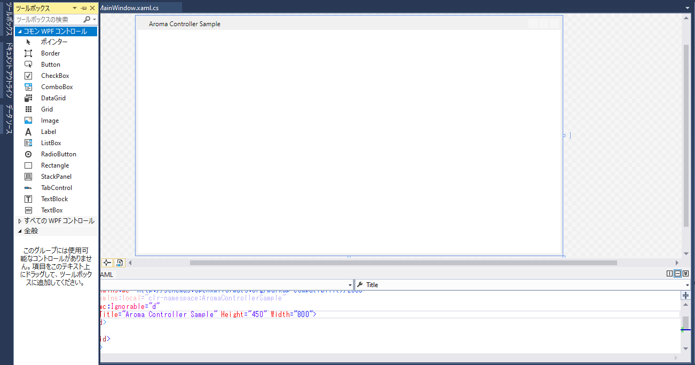
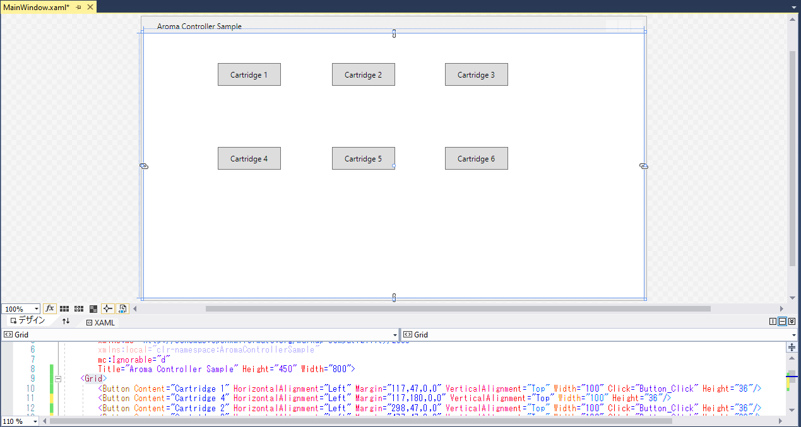
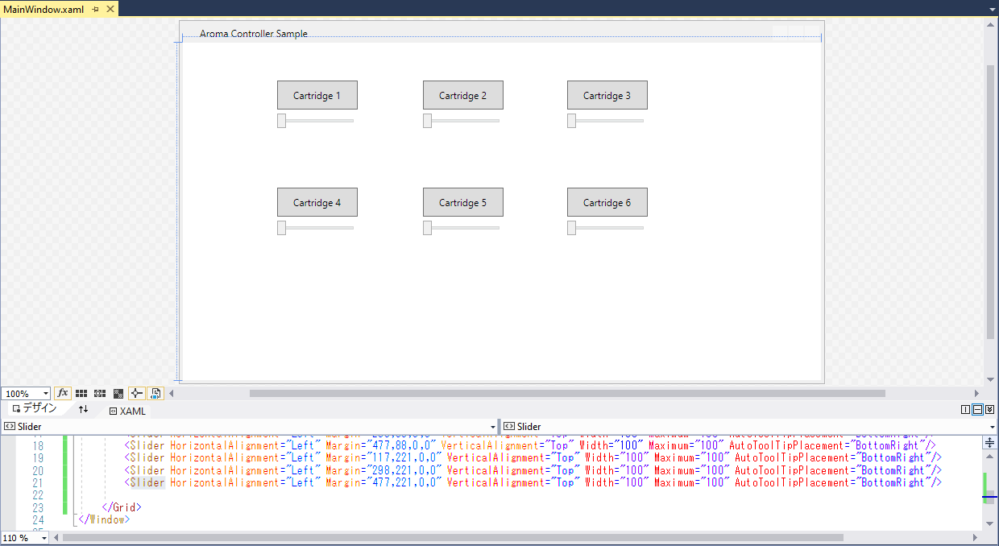
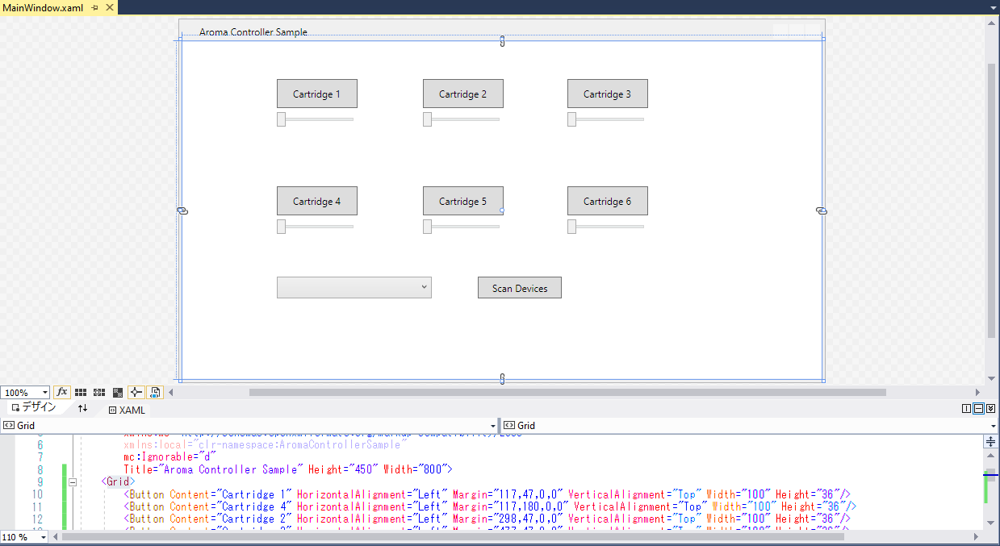
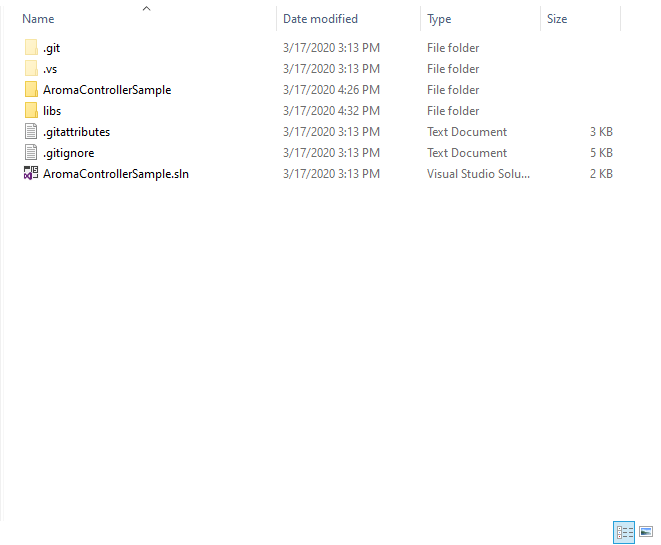
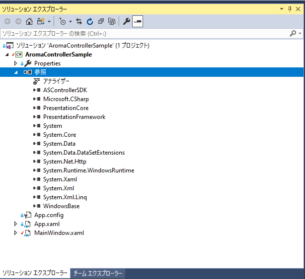

# Step-by-step developing Aroma Controller on Windows 10

0. ## Who is this tutorial for?

    Those who want to learn: how to develop with **Aroma Shooters** on **Windows** via **USB** connection using **C#**. 

    The completed application will look like this:

    

1. ## Preparation

   - Aroma Shooter 1st generation USB type **or** Aroma Shooter 2nd generation.
   - Windows 10 PC with Visual Studio Community installed.
   - **ASControllerSDK.dll** and **System.Runtime.WindowsRuntime.dll** from [Latest release of Aroma Windows SDK](https://github.com/aromajoin/controller-sdk-windows/releases).
   - Your enthusiasm.

2. ## Start

-    At first, create a new project.



- Choose "WPF app" and name the project "Aroma Controller Sample".

  

- Rename the main window title from "MainWindow" to "Aroma Controller Sample".

  

- Drag 6 buttons to the main windows.
  
  
- Layout and name the buttons.

  

- Drag and layout 6 sliders. Change the attribute "**AutoToolTipPlacement**" of all 6 sliders to "BottomRight".

  

- Add a ComboBox for showing list of connected Aroma Shooters via USB, and name it *CmbBoxDeviceList*. Add a button to trigger scanning connected Aroma Shooters.

  

- Now we are done with the GUI of this sample. Next we will work on the code. At first, create "libs" folder in your solution folder, as illustrated below. Copy **ASControllerSDK.dll** and **System.Runtime.WindowsRuntime.dll** into "libs" folder.

  

- Add reference from the solution to **ASControllerSDK.dll** and **System.Runtime.WindowsRuntime.dll**.

  

- Open your *MainWindow.xaml.cs* and add the following lines to the beginning of the file.

  ```c#
  using System;
  using System.Collections.Generic;
  using System.Threading;
  using System.Windows;
  using System.Windows.Input;
  using ASControllerSDK;
  ```

- Declare and initialize a new member to your *MainWindow* class as below.

  ```c#
  AromaShooterController controller = AromaShooterController.SharedInstance;
  ```

- Add a *Click* event handler for the button *Scan Devices* as illustrated below.

  

- Then add *BtnClick_ScanDevices* function to your *MainWindow* class as below.

  ```c#
          private void BtnClick_ScanDevices(object sender, RoutedEventArgs e)
          {           
              controller.Setup(); // This needs to be called whenever 
                                  // you want to scan for Aroma Shooters.
              
              // Wait for scanning in one second (1000 miliseconds)
              this.Cursor = Cursors.Wait;
              Thread.Sleep(1000);
              this.Cursor = Cursors.Arrow;
  
              // Transfer the list of connected devices to the combo box.
              List<String> connectedDevices = controller.GetConnectedDevices();
              CmbBoxDeviceList.ItemsSource = connectedDevices;
              CmbBoxDeviceList.SelectedIndex = connectedDevices.Count > 0 ? 0 : -1;
          }
  
  ```

  

- Next step is to work with the sliders and cartridge buttons. We have six sliders. 

  So name them with *SliderIntensity1*, *SliderIntensity2*, ..., *SliderIntensity6* corresponding to the cartridges 1 to 6. 

  Put names of event handlers for clicking cartridges as *BtnClickCartridge1*, *BtnClickCartridge2*, ..., *BtnClickCartridge6*. 

  After that we are going to put some code to handle those clicking events. At first, declare and initialize a member for your *MainWindow* class to specify a duration for diffusion whenever a cartridge button is clicked as follow.

  ```c#
  int duration = 1000; // miliseconds
  ```

- Then put the following code to handle the click event of cartridge 1. And put similar code to handle the click events of other cartridges.

  ```C#
          private void BtnClick_Cartridge1(object sender, RoutedEventArgs e)
          {
              // Casting is needed because Value is of type double.
              int intensity =  (int) SliderIntensity1.Value; 
  
              if (CmbBoxDeviceList.SelectedItem != null)
              {
                  // Get the selected Aroma Shooter
                 String selectedAromaShooter = CmbBoxDeviceList.SelectedItem.ToString();
  
                  // Create an AromaPort object for cartridge 1
                  AromaPort aPort = new AromaPort();
                  aPort.intensity = intensity;
                  aPort.number = 1;
  
                  // Create a list of AromaPort to store the port of cartridge 1
                  List<AromaPort> aPortList = new List<AromaPort>();
                  aPortList.Add(aPort);
  
                  // Diffuse in duration = 1000 miliseconds on port 1, 
                  // booster intensity = 50, 
                  // fan intensity = 0, 
                  // on the selectedAromaShooter.
                  controller.Diffuse(duration, aPortList, 50, 0, selectedAromaShooter);
              }
          }
  ```

  

  After finishing put handling code for all cartridges, you are done with the implementation!

3. ## Enjoy running

   You can run the app in Debug mode or build the app by choosing Release mode then run the built app. The built app can be shared to others!

   Besides 6 channels, there is a non-smell channel called booster and a channel for an attach-type fan.

   The full source code of this example can be find [here](https://drive.google.com/open?id=1wxX946lBUI7osNabms0wGFfrKg9EATEZ)

4. ## Where do we go from here?

   This is just a very basic application which guide you through the process to use separate functionalities  of Aroma Shooters. 

   This application is using USB connection. But the newest version of Aroma Shooter can work with Wi-Fi and also BLE connections as well. We will provide guide on using those other types of connections in other tutorials.

   From here, your creativity is the only limitation. Some of hints could be:

   - aroma alarm clock
   - aroma music
   - aroma movie
   - aroma for better sleep
   - ...

